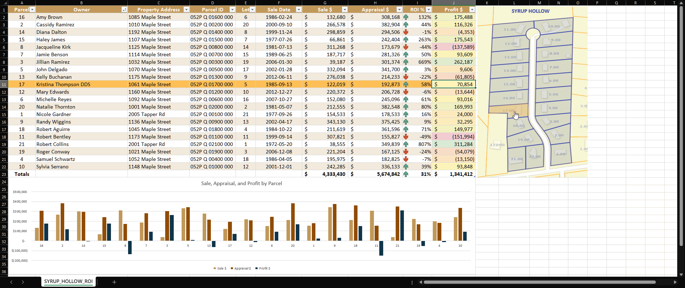
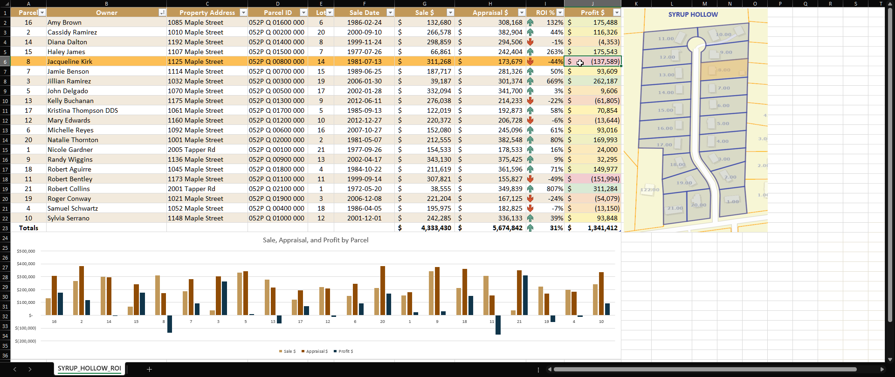
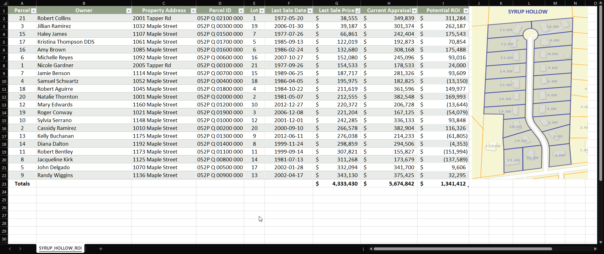

# Neighborhood Property Value Tracker

--- 

An **Excel** and **Python** project visualizes property values in the fictional neighborhood Syrup Hollow and tracks changes over time.  
Clicking parcels on the map highlights the corresponding row in the data table, and selecting a row highlights its parcel on the map.

--- 

## Features
- Dynamic row highlighting in Excel based on map clicks or table selection  
- Visual linking between map parcels and table data  
- Tracks last sale date, most recent sale, market appraisal, and potential ROI  
- Built-in macros (VBA) for interactivity  
- Python script for scraping & preparing property data  

--- 

## Project Background

This project was developed as a **learning exercise** to practice:  
- Excel VBA for dynamic interactivity  
- Python for data scraping and preprocessing  
- Structuring a project for maintainability and clarity  

The focus was on understanding workflows, debugging, and connecting Excel tables with map visuals.  
Some parts may be experimental or imperfect, but the goal was to practice problem-solving and improve coding skills.

--- 

## Notes
- All personal and sensitive information has been anonymized  
- Parcel numbers are randomized between **1–21**  
- Owner names, street names, and sale dates are **fake for privacy**  
- A real map is included for visualization, but no resident-identifying data is exposed  

---

## Screenshots & Demo GIF

### Excel Table Fresh/Unselected

### Interactive Map Selection

### Interactive Row Selection

### Demo (GIF)

---

## Acknowledgements

Assistance with coding, Excel formulas, and Python scripting was obtained from AI tools including:

- **ChatGPT (GPT-5-mini)**
- **Gemini (2.5 Flash)**
- **Claude (Sonnet 4)** — provided the most accurate and complete guidance
 

All code was actively developed and refined with human oversight — issues were identified and corrected during the process.  

