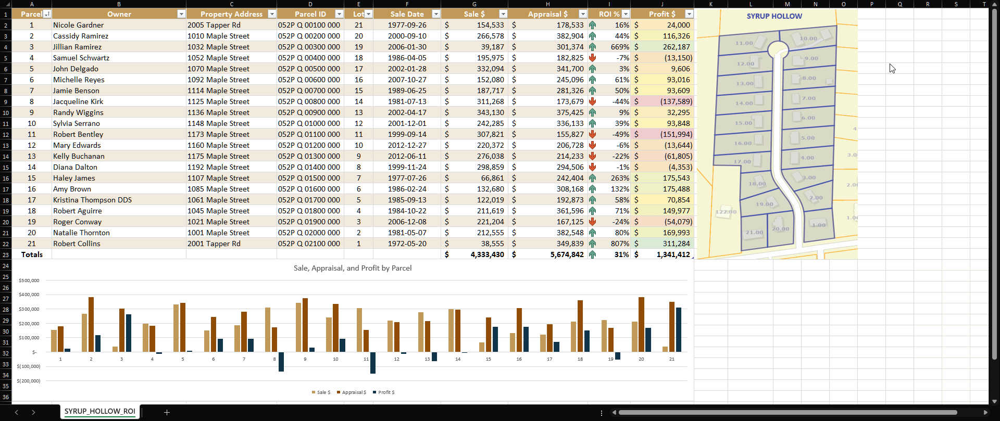

# Interactive Real Estate Investment Tracker for Local Markets

An **Excel** and **Python** project that delivers a dynamic dashboard for visualizing and analyzing property values in a target neighborhood. The tool solves a key problem for real estate investors by interactively linking map parcels to a corresponding data table, allowing for rapid analysis and decision-making.

---

## The Business Problem

A local real estate investor needs an intuitive, visual tool to track properties in a target neighborhood like "Syrup Hollow." They require a single dashboard to monitor key investment metrics—last sale date, current market appraisal, and potential ROI—and to quickly visualize the relationship between properties on a map and their underlying financial data.

---

## The Solution: An Interactive Investment Dashboard

This project delivers a fully interactive Excel dashboard that directly solves this problem. By dynamically linking map parcels to a data table using VBA macros, an investor can instantly identify and analyze properties of interest. The tool centralizes critical data, saving hours of manual cross-referencing between maps and spreadsheets and enabling faster, more informed investment decisions.

---

## Live Demo

### Interactive Map Selection
Clicking a parcel on the map instantly highlights the corresponding row in the data table.

### Interactive Row Selection
Conversely, selecting a row in the table highlights its parcel on the map.

### Full Workflow (GIF)

---

## Key Features & Technologies

* **Dynamic Highlighting:** Uses **Excel VBA** macros for two-way interactivity between the map and the data table.
* **Visual Data Linking:** Creates a clear, intuitive connection between geographic parcels and their associated financial data.
* **Comprehensive Metrics:** Tracks last sale date, most recent sale price, current market appraisal, and calculates potential ROI.
* **Automated Data Prep:** A **Python** script is used for the initial scraping and preparation of the property data.

---

## Data & Anonymization Notes

* All personal and sensitive information in this public-facing project has been anonymized.
* Parcel numbers are randomized between **1–21**.
* Owner names, street names, and sale dates are **fictional to protect privacy**.
* A real map is included for visualization, but no resident-identifying data is exposed.

---

## Acknowledgements

Assistance with coding, Excel formulas, and Python scripting was obtained from AI tools including:

-   **ChatGPT (GPT-5-mini)**
-   **Gemini (2.5 Flash)**
-   **Claude (Sonnet 4)** — provided the most accurate and complete guidance

All code was actively developed and refined with human oversight — issues were identified and corrected during the process.